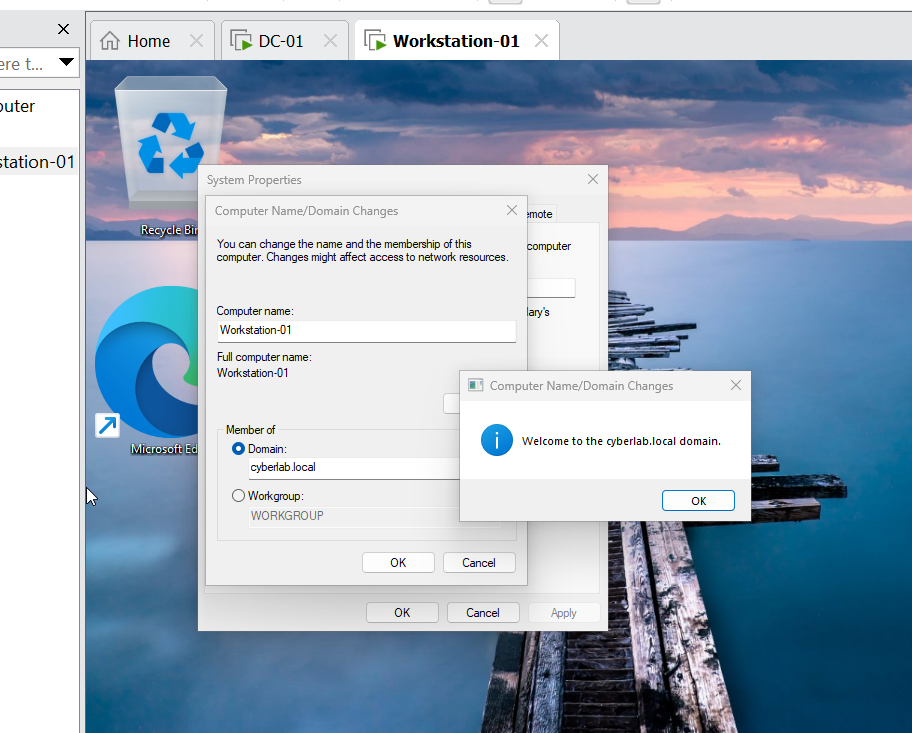
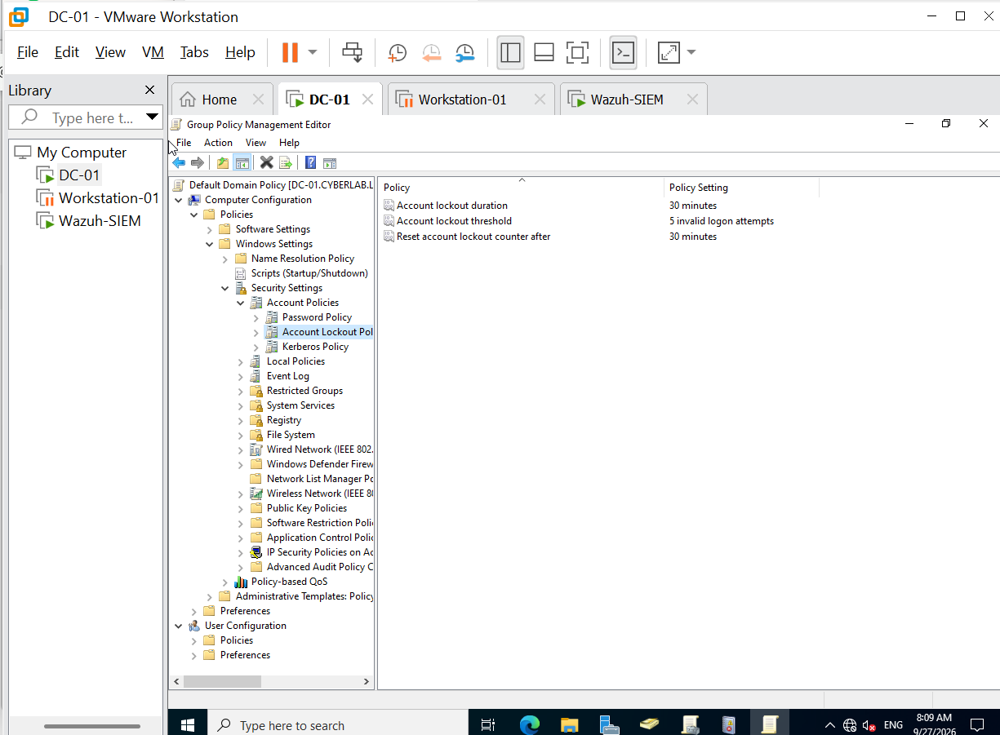
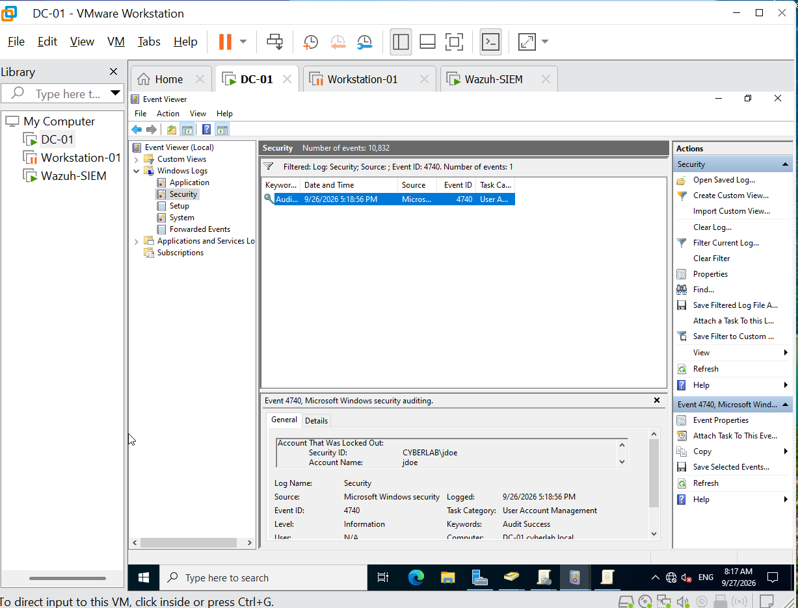
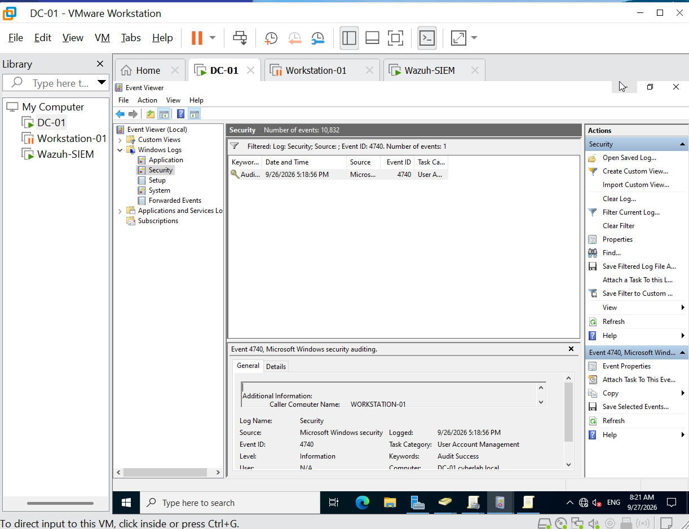

# Windows Active Directory Security Home Lab
This hands-on cybersecurity home lab demonstrates the end-to-end orchestration of an enterprise threat simulation and forensic incident response cycle. Operating within a securely isolated VMware Workstation sandbox, I deployed a Windows Server Active Directory Domain Controller (DC-01) alongside a Windows 11 Client (Workstation-01). After configuring robust Domain Group Policies, specifically enforcing account lockout thresholds to mitigate brute-force vectors, I executed an intentional credential-stuffing attack simulation. Utilizing native Windows Security Event logs and telemetry parsing, I successfully conducted a root-cause forensic analysis. The investigation effectively identified the targeted asset (Account: jdoe) and tracked the precise malicious origin network handle (Caller Computer: WORKSTATION-01), successfully validating the integrity of the defensive posture.
### Skills Gained & Technologies Used
* **Active Directory Domain Services (AD DS):** User provisioning, Domain Controller management, and naming services infrastructure.
* **Windows Server 2022 & Windows 11 Enterprise:** Enterprise operating system integration, static network routing, and secure domain joining.
* **Group Policy Management (GPO):** Configuring and deploying global account lockout thresholds to enforce system hardening policies.
* **Endpoint Telemetry & Forensic Analysis:** Auditing native Windows Security Event Logs and Microsoft Sysmon artifacts to track adversarial execution chains.
* **Virtualization Architecture:** Virtual sandbox orchestration and Host-Only networking isolation using VMware Workstation Pro.

---

---

## Lab Architecture Overview
This lab features an isolated corporate environment designed to mimic standard enterprise directory services and client systems. 

| Machine Name | Operating System | IP Address | Network Role |
| :--- | :--- | :--- | :--- |
| **DC-01** | Windows Server 2022 | `192.168.10.10` | Domain Controller & DNS Server |
| **Workstation-01** | Windows 11 Enterprise | `192.168.10.20` | Domain Joined Employee Desktop |

## Step-by-Step Implementation Details

### 1. Network & Domain Controller Provisioning
- Deployed a virtualized environment using **VMware Workstation Pro** configured with an isolated **Host-Only** network adapter.
- Configured a static IP framework on `DC-01` pointing to the local loopback address (`127.0.0.1`) for primary naming services.
- Installed **Active Directory Domain Services (AD DS)** and promoted the host to a root forest node named `cyberlab.local`.
- Created an Organizational Unit (OU) named `Employees` and provisioned a standard user profile (`jdoe`).

### 2. Client Workstation Integration
- Deployed **Windows 11 Enterprise** onto an independent virtual asset.
- Tailored network configurations to target `192.168.10.10` as the Preferred DNS handler.
- Authorized and completed a secure domain merge process using primary network administrative credentials.

## Verification of Target Domain Integration
Below is confirmation of the successful registration and integration of `Workstation-01` into the target `cyberlab.local` naming infrastructure:

## Active Directory Group Policy Enforcements & Threat Simulations
- **Security Hardening:** Provisioned custom Domain Group Policies (GPOs) modifying default account security registers to actively limit maximum unauthenticated logon threshold cycles to **5 invalid attempts**.
- **Brute-Force Execution:** Simulated an automated credential stuffing scenario on endpoint nodes targeting standard organizational user containers.
- **Incident Response Artifacts:** Successfully caught and investigated **Event ID 4740 (Account Lockout)** entries across domain system controllers, tracking execution chains back to source identifiers (`Workstation-01`) and target victims (`CYBERLAB\jdoe`).

### Threat Simulation Forensic Artifacts

**Figure 4.1: Domain Group Policy Hardening Rules**

**Figure 4.2: Event ID 4740 Forensic Discovery - Target Account Identified**

**Figure 4.3: Event ID 4740 Forensic Discovery - Attack Source Tracked**

## Future Enhancements
To build upon this defensive baseline, I plan to expand the environment with the following capabilities:
* **Centralized EDR Deployment:** Install an open-source Endpoint Detection & Response (EDR) agent (like LimaCharlie or Wazuh) on Workstation-01 to monitor real-time process injection attempts.
* **Network Segmentation:** Implement a virtualized pfSense firewall to isolate the Employee OU subnet from administrative infrastructure zones.
* **Log Aggregation Pipelines:** Re-attempt a native architecture pipeline deployment to stream Sysmon logs into an independent log analysis framework for automated threat alerting.
